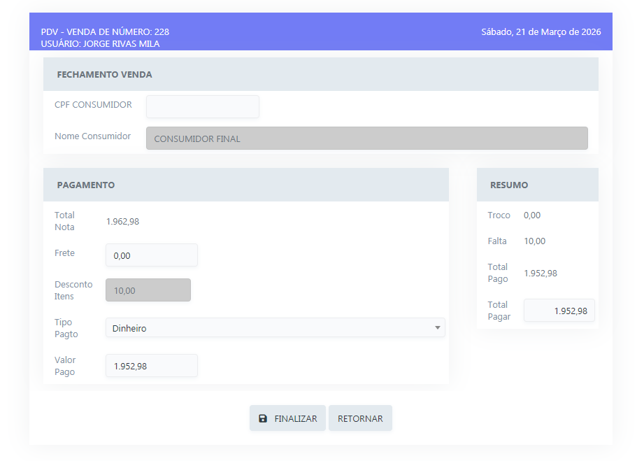
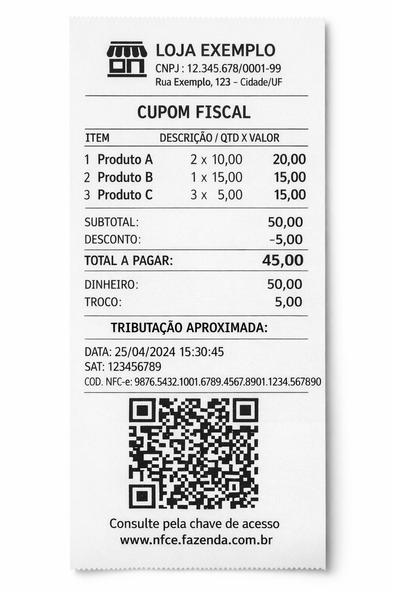
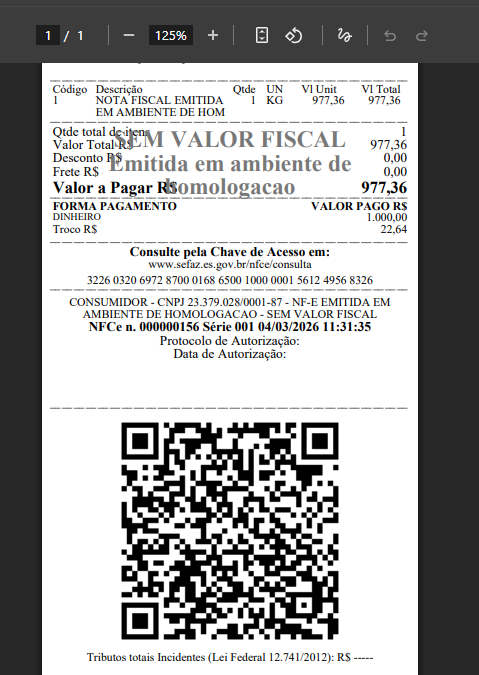
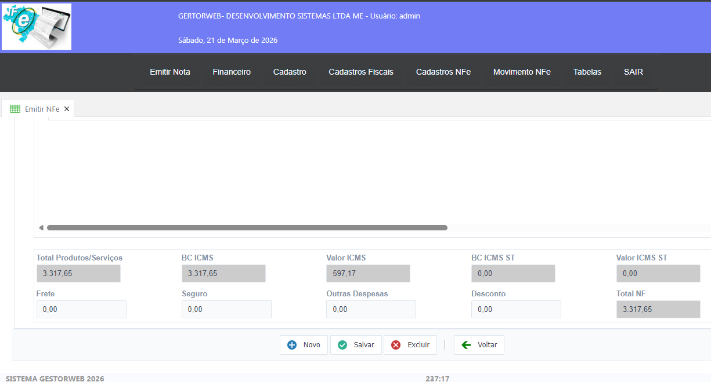
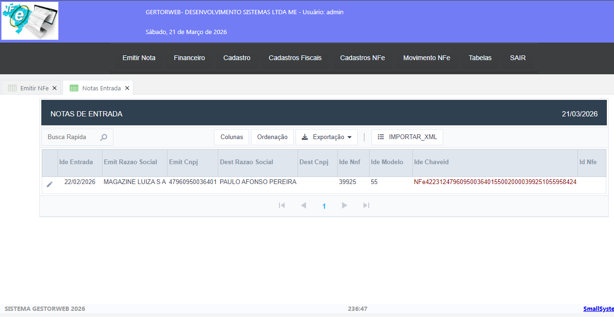

# 🚀 PROJETO NFe / NFCe 2026 - Código Fonte

Preparado para a Reforma Tributária 2026

Projeto Profissional em Scriptcase 9.x

Sistema completo de **NF-e / NFC-e + PDV** desenvolvido em **Scriptcase**.

Projeto base para desenvolvimento de **sistemas comerciais e ERP**, com integração fiscal, financeira e operacional.

---
## Demonstracao do Sistema

## Demonstracao do Sistema

---

# 📌 Principais Recursos

## Emissão Fiscal

✔ Emissão de **NF-e (Nota Fiscal Eletrônica)**  
✔ Emissão de **NFC-e (Cupom Fiscal Eletrônico)**  
✔ Comunicação direta com a **SEFAZ**  
✔ Cancelamento de documentos  
✔ Inutilização de numeração  
✔ Geração e validação de **XML**

---

## 🚀 Sistema Inteligente (Anti-Rejeição SEFAZ)

Chega de perder tempo corrigindo NF rejeitada.

O Gestoweb2026 automatiza decisões fiscais críticas:

🔹 Detecta automaticamente operações interestaduais  
🔹 Aplica regras fiscais conforme a legislação vigente  
🔹 Define CFOP correto sem intervenção manual  
🔹 Calcula impostos com base no cenário real da operação  
🔹 Minimiza erros e rejeições na SEFAZ  

💡 Mais produtividade, menos dor de cabeça.

---

## 🛒 PDV Completo

✔ Venda direta no **PDV**  
✔ Emissão automática de **NFC-e**
✔ Impressão direta em **impressoras térmicas ESC/POS**  
✔ Impressão de **QR Code da NFC-e**  
✔ Impressão de **logo no cabeçalho do cupom**  

---

## 📊 Integração Financeira

✔ Geração automática de **parcelas na venda a prazo**  
✔ Controle de **contas a receber**  
✔ Controle de **contas a pagar**  
✔ Lançamentos automáticos no **caixa**

---

## 💰 Diferencial comercial

👉 Emissão NFC-e em tempo real (síncrona) sem travamentos
👉 Tratamento automático de rejeições SEFAZ
👉 Histórico completo de XML e protocolo

---

## 📥 Importação Inteligente de XML

O sistema possui um módulo de **importação automática de XML de NF-e**.

Durante a importação o sistema pode:

✔ Cadastrar automaticamente **fornecedores**  
✔ Cadastrar automaticamente **clientes**  
✔ Atualizar ou cadastrar **produtos**  
✔ Atualizar dados fiscais dos produtos  
✔ Registrar entrada de documentos fiscais

---

## 💼 Por que escolher o projeto erpweb2026?

✔ Reduz erros e rejeições na SEFAZ  
✔ Automatiza regras fiscais complexas  
✔ Acelera o desenvolvimento de sistemas ERP  
✔ Pronto para legislação atual e futura  
✔ Estrutura profissional e escalável  

---

## 🏆 Diferenciais Técnicos

✔ Emissão NFC-e síncrona sem travamentos  
✔ Tratamento automático de rejeições  
✔ Estrutura pronta para múltiplas empresas  
✔ Histórico completo de XML e protocolos  
✔ Arquitetura pronta para expansão (ERP)

---

# 🖥 Demonstração do Sistema

## Tela do PDV

---

## Emissão de NFCe

---

## Fechamento de NFCe

---

## Cupom NFCe

---

## Cupom NFCe

---

## Cupom NFCe

---

## Tela da NFe

---

---

---

---

---

---

---

# 🎯 Ideal para

✔ Desenvolvedores **Scriptcase**  
✔ Sistemas de **automação comercial**  
✔ Desenvolvimento de **ERP**  
✔ Sistemas de **gestão empresarial**

---

# 📞 Contato

Caso tenha interesse no projeto ou queira mais informações:

📧 Email: paulopap2023@gmail.com  

---

# ⭐ Observação

Este projeto serve como **base profissional para desenvolvimento de sistemas comerciais completos em Scriptcase**, acelerando significativamente o tempo de desenvolvimento.

---
